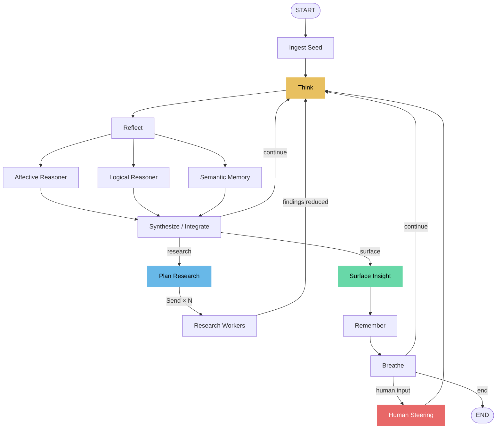

# Ouroboros — Recursive Introspection Engine

An autonomous reasoning system built with [LangGraph](https://github.com/langchain-ai/langgraph) that recursively reflects on its own thinking through **genuine multi-perspective analysis**, semantic memory, and optional external research — then **measures whether that recursion actually beats a single prompt.**


## Why this exists

Most LLM interactions are one-shot: you ask, it answers. Ouroboros loops on its own thinking — each cycle runs **three real reasoners in parallel** (affective, logical, analogical-memory), an LLM **synthesis** step that reconciles their tension, and a decision to go deeper, research externally, or surface an insight.

The claim is that recursive multi-perspective analysis with accumulated state produces better output than a single prompt. **This repo doesn't just assert that — it ships an evaluation harness that tests it.**

## Does it actually work?

The [`evals/`](evals/) harness runs Ouroboros against a fair **single-shot baseline** (same model) on a fixed task set, scored by a **blind, position-swapped pairwise judge** running a *different* free model (so it can't just prefer its own style). See [evals/README.md](evals/README.md) for the methodology and bias controls.

```bash
pip install -e ".[eval]"
# free Groq key in .env; use a different model as judge to stay unbiased:
export EVAL_JUDGE_MODEL=llama-3.1-8b-instant
python -m evals run        # → evals/results/results.json
python -m evals plot       # → evals/results/chart.png
```

> **Generate the chart, then embed it here** (``). Report the real numbers — including modes where recursion *doesn't* win. An honest "wins on analyze/solve, ties on explore" is more credible than a clean sweep.

## Runs entirely on free tier

| Mode | How | Keys |
|------|-----|------|
| **Groq (default)** | Free API tier serving Llama 3.3 70B | one free key |
| **Ollama (local)** | Models run on your machine, fully offline | **none** |
| Semantic memory | Local `all-MiniLM-L6-v2` embeddings | none (offline) |
| Eval judge | Any free model (different from generator) | reuses Groq key |

Every run reports **token usage and estimated cost** (≈ $0.00 on free models, real numbers on paid ones). LangSmith tracing is available and opt-in.

## Quick start

```bash
pip install -e .

# Option A — free hosted (Groq): get a key at https://console.groq.com
echo "GROQ_API_KEY=gsk_..." > .env

# Option B — fully local, zero keys (requires a running Ollama server)
pip install -e ".[local]"
# in .env: LLM_PROVIDER=ollama   then:  ollama pull llama3.2

# For genuine semantic memory (recommended):
pip install -e ".[memory]"

# Run it
ouroboros run "What is consciousness?"
ouroboros run "Should we ship v2?" --mode analyze --no-steer
cat strategy.md | ouroboros run "What are the blind spots?" --mode solve -f quiet

# Web UI
uvicorn ouroboros.server:app --reload   # http://localhost:8000
```

## Architecture



- **Affective / logical reasoners** are distinct LLM calls with different lenses (the cheap keyword-mood acts only as a prior that steers routing).
- **Semantic memory** is real embedding-based retrieval (cosine over `all-MiniLM-L6-v2`), with a deterministic lexical fallback so it works offline / without the model.
- **Synthesize** is an LLM step that integrates the three readings and names the key tension — not string concatenation.
- **Research** uses the LangGraph `Send` API for dynamic map-reduce: a planner emits N sub-queries, fanned out to parallel workers, whose findings reduce back into state.
- Every LLM node has a fallback, so free-tier rate limits degrade gracefully instead of crashing a run.

## Watch it think (the web UI)

`uvicorn ouroboros.server:app --reload` → open http://localhost:8000. The live view streams the engine's inner monologue **token by token** while the actual LangGraph topology lights up node-by-node — fan-out into the three perspectives, the research workers, the loop closing each cycle — with mood as colour, a draining energy meter, and insights crystallizing as they surface. The animation *is* the state machine executing, over a WebSocket.

> **Record a ~15s GIF of a live run and embed it here** — it's the single most effective thing on this page.

## CLI reference

```
ouroboros run "seed thought" [options]
  -m, --mode     explore|analyze|create|solve|philosophize
  -d, --depth    Max rumination depth (1-10)
  -e, --energy   Starting energy (20-100)
  --max-cycles   Max loop cycles before termination
  --no-steer     Fully autonomous (no human steering pauses)
  -f, --format   rich|quiet|json
  --db           Session database path

ouroboros sessions                          # List saved sessions
ouroboros export <id> [-f json|markdown]     # Export a session
ouroboros delete <id>                        # Delete a session
```

Pipe content in, or run non-interactively for scripts/CI:

```bash
echo "Our Q4 strategy assumes 40% growth" | ouroboros run "Challenge this assumption" --mode solve -f quiet
ouroboros run "Review this architecture decision" --no-steer -f json > review.json
```

## Modes

| Mode | Icon | Best for |
|------|------|----------|
| Explore | ◎ | General curiosity, brainstorming |
| Analyze | △ | Decision support, risk analysis |
| Create | ✦ | Creative projects, innovation |
| Solve | ◈ | Technical problems, strategy |
| Philosophize | ∅ | Ethics, meaning, foundations |

Each mode changes prompts, depth limits, energy dynamics, mood-shift rates, and research behavior.

## Configuration

Environment variables (or `.env`):

| Variable | Default | Description |
|----------|---------|-------------|
| `LLM_PROVIDER` | `groq` | `groq`, `ollama`, or `openai` |
| `GROQ_API_KEY` | — | Free tier; required for the Groq provider |
| `GROQ_MODEL` | `llama-3.3-70b-versatile` | Groq model |
| `OLLAMA_MODEL` | `llama3.2` | Local model (provider `ollama`) |
| `OLLAMA_BASE_URL` | `http://localhost:11434` | Ollama server URL |
| `OPENAI_API_KEY` / `OPENAI_MODEL` | — / `gpt-4o-mini` | Optional OpenAI provider |
| `TAVILY_API_KEY` | — | Optional; enables live web search |
| `LLM_TEMPERATURE` | `0.7` | Sampling temperature |
| `LANGSMITH_TRACING` | `false` | Opt-in LangSmith tracing |
| `ALLOWED_ORIGINS` | `*` | CORS allowlist for the web server |
| `DEMO_MODE` / `MAX_DEMO_CYCLES` / `MAX_CONCURRENT_SESSIONS` | `false` / `8` / `5` | Public-demo resource caps |

### Optional extras

```bash
pip install -e ".[memory]"   # real semantic embeddings (sentence-transformers)
pip install -e ".[local]"    # Ollama provider (fully local)
pip install -e ".[persist]"  # durable sqlite checkpointing (resumable sessions)
pip install -e ".[eval]"     # evaluation harness charting (matplotlib)
pip install -e ".[search]"   # Tavily web search
pip install -e ".[dev]"      # tests + lint
```

## API

```
GET  /api/modes                     POST /api/start?seed=...&mode=...
POST /api/steer/{id}                POST /api/stop/{id}
GET  /api/state                     GET  /api/sessions
GET  /api/sessions/{id}             GET  /api/sessions/{id}/export
DELETE /api/sessions/{id}           WS   /ws   (live streaming)
```

## LangGraph patterns demonstrated

| Pattern | Where |
|---------|-------|
| Fan-out / fan-in | reflect → (affective ∥ logical ∥ memory) → synthesize |
| `Send` API map-reduce | plan_research → N parallel research_workers → reduce |
| Conditional routing | synthesize → think \| research \| surface |
| Human-in-the-loop | breathe → steer (`interrupt_before`) |
| Custom state reducers | deduplicating `extend_list` for memories/insights/findings |
| Durable checkpointing | MemorySaver, or AsyncSqliteSaver (resumable across restarts) |
| Multi-mode streaming | `astream(stream_mode=["updates","messages"])` → live token UI |
| Autonomous loop control | energy drain, loop guard, depth limits |

## Project structure

```
ouroboros/
├── cli.py            # CLI (run/sessions/export/delete), token+cost summary
├── config.py         # Pydantic settings (providers, tracing, demo caps)
├── providers.py      # Single LLM factory: groq | ollama | openai
├── memory.py         # Semantic memory: embeddings + lexical fallback
├── checkpointing.py  # Checkpointer factory: MemorySaver | AsyncSqliteSaver
├── usage.py          # Token/cost accounting + opt-in LangSmith tracing
├── models.py         # Mode, OuroborosConfig, session models
├── presets.py        # Per-mode prompts and tuning
├── store.py          # SQLite session persistence
├── server.py         # FastAPI app: REST + WebSocket, CORS/demo hardening
├── graph/
│   ├── state.py      # State schema + custom reducers
│   ├── tools.py      # @tool defs (web_search, semantic retrieve_memories)
│   ├── nodes.py      # Node implementations (LLM reasoners + fallbacks)
│   └── builder.py    # Graph construction
├── static/index.html # Web UI
└── tests/            # graph, tools, api, cli, providers, usage, memory, evals
evals/                # Ouroboros vs single-shot: harness, judge, chart
```

## Development

```bash
pip install -e ".[dev]"
pytest -q
ruff check ouroboros/ evals/
```

## Docker

```bash
docker compose up --build
```

## License

MIT
