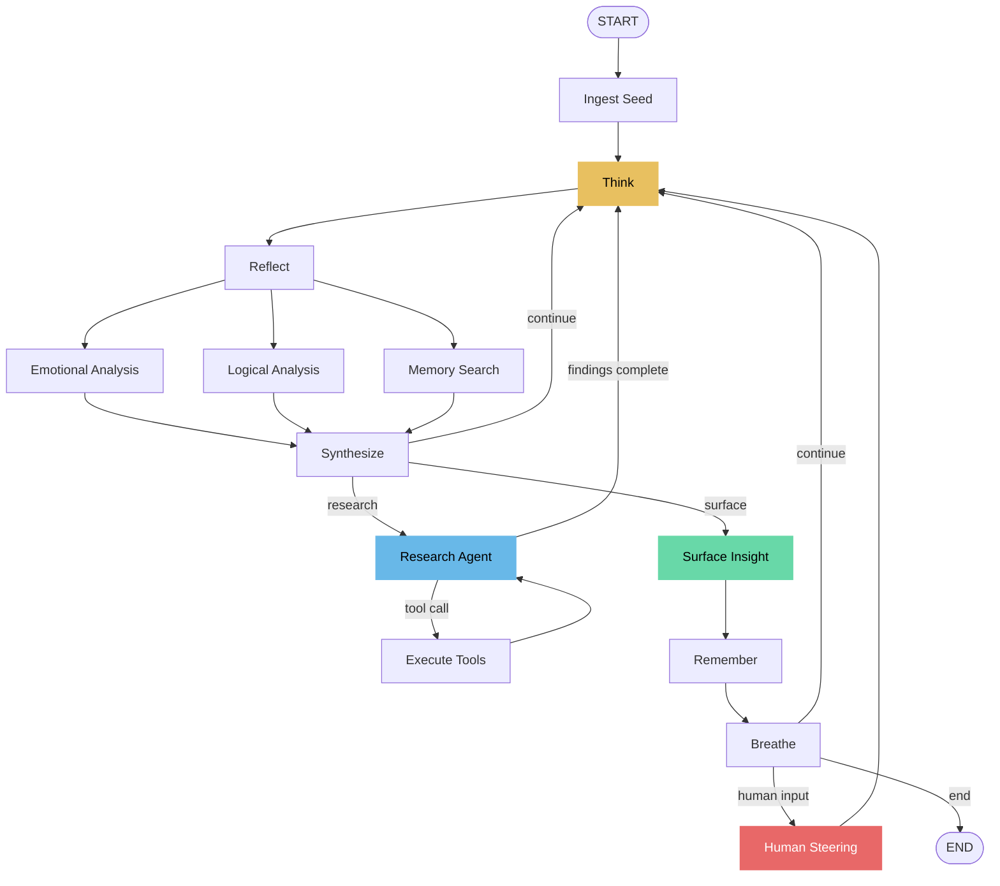

# Ouroboros — Recursive Introspection Engine

An autonomous reasoning system built with [LangGraph](https://github.com/langchain-ai/langgraph) that recursively reflects on its own thinking through multi-perspective analysis, emotional modeling, and optional external research.


## Why This Exists

Most LLM interactions are one-shot: you ask, it answers. Ouroboros does something structurally different — it **automatically loops on its own thinking**, with each cycle running parallel analysis from emotional, logical, and memory perspectives, then synthesizing the results before deciding whether to go deeper, research externally, or surface an insight.

The key insight: recursive multi-perspective analysis with accumulated state produces outputs you cannot get from a single prompt or from chain-of-thought reasoning.

## Architecture



## LangGraph Patterns Demonstrated

This project serves as a practical reference for advanced LangGraph patterns:

| Pattern | Where | Description |
|---------|-------|-------------|
| **Fan-out / Fan-in** | reflect → emotional + logical + memory → synthesize | Parallel multi-perspective analysis |
| **ToolNode integration** | research_agent → execute_tool → research_agent | LLM-driven tool calling with `bind_tools` + `ToolNode` |
| **Conditional routing** | synthesize → think \| research \| surface | State-dependent routing with multiple outcomes |
| **Human-in-the-loop** | breathe → steer (interrupt_before) | Graph pauses for human steering, resumes with input |
| **Custom state reducers** | `extend_list` for memories, insights, research queries | Deduplicating append reducer pattern |
| **Checkpointing** | MemorySaver (default), SqliteSaver (optional) | State persistence across interrupts |
| **Mood modeling** | emotional_analysis → mood shifts | Non-deterministic state transitions based on content |
| **Energy/guard rails** | energy drain, loop_guard, depth limits | Autonomous loop control with multiple termination conditions |

## Quick Start

```bash
# Install
pip install -e .

# Set your API key
export GROQ_API_KEY=gsk_...

# CLI (the main interface)
ouroboros run "What is consciousness?"
ouroboros run "Should we ship v2?" --mode analyze --no-steer
cat strategy.md | ouroboros run "What are the blind spots?" --mode solve -f quiet

# Web UI
uvicorn ouroboros.server:app --reload
open http://localhost:8000
```

## CLI Reference

```
ouroboros run "seed thought" [options]

Options:
  -m, --mode     Introspection mode: explore|analyze|create|solve|philosophize
  -d, --depth    Max rumination depth (1-10)
  -e, --energy   Starting energy (20-100)
  --max-cycles   Max loop cycles before termination
  --no-steer     Fully autonomous (no human steering pauses)
  -f, --format   Output: rich|quiet|json
  --db           Session database path

ouroboros sessions              # List saved sessions
ouroboros export <id> [-f json|markdown]  # Export a session
ouroboros delete <id>          # Delete a session
```

**Pipe content in:**
```bash
cat research_paper.md | ouroboros run "Key risks and blind spots" --mode analyze
echo "Our Q4 strategy assumes 40% growth" | ouroboros run "Challenge this assumption" --mode solve -f quiet
```

**Non-interactive (for scripts/CI):**
```bash
ouroboros run "Review this architecture decision" --no-steer -f json > review.json
```

**Human steering:**
When the graph pauses, type input to redirect + Enter, or just Enter to continue:
```
THINK  The current approach assumes linear growth...
│ curious  energy ████████░░  80% │ depth 1 │ cycle 1 │

⏸ Graph paused for steering. Type input + Enter to redirect, or Enter to continue:
> What if growth is exponential instead?
```

**Output formats:**
- `rich` — colored terminal output with live state bars (default)
- `quiet` — only surfaced insights (pipe to files, other tools)
- `json` — newline-delimited JSON events (parse programmatically)

## Modes

| Mode | Icon | Description | Best For |
|------|------|-------------|----------|
| Explore | ◎ | Free-form introspection | General curiosity, brainstorming |
| Analyze | △ | Structured deep-dive | Decision support, risk analysis |
| Create | ✦ | Divergent ideation | Creative projects, innovation |
| Solve | ◈ | Iterative problem-solving | Technical problems, strategy |
| Philosophize | ∅ | Deep philosophical inquiry | Ethics, meaning, foundations |

Each mode changes the prompts, depth limits, energy dynamics, mood shift rates, and research behavior.

## API

```
GET  /api/modes                    # List available modes
POST /api/start?seed=...&mode=...   # Start a rumination session
POST /api/steer/{session_id}       # Provide human steering input
POST /api/stop/{session_id}        # Stop a running session
POST /api/reset                     # Reset all state
GET  /api/state                     # Current session state
GET  /api/sessions                  # List all sessions
GET  /api/sessions/{id}             # Get session details
GET  /api/sessions/{id}/export     # Export as JSON or Markdown
DELETE /api/sessions/{id}           # Delete a session
WS   /ws                           # WebSocket for live streaming
```

## Configuration

Environment variables (or `.env` file):

| Variable | Default | Description |
|----------|---------|-------------|
| `LLM_PROVIDER` | `groq` | `groq` or `openai` |
| `GROQ_API_KEY` | — | Required for Groq provider |
| `GROQ_MODEL` | `llama-3.3-70b-versatile` | Groq model to use |
| `OPENAI_API_KEY` | — | Required for OpenAI provider |
| `OPENAI_MODEL` | `gpt-4o-mini` | OpenAI model to use |
| `TAVILY_API_KEY` | — | Optional, enables live web search |
| `LLM_TEMPERATURE` | `0.7` | LLM temperature |

## Project Structure

```
ouroboros/
├── __init__.py
├── __main__.py         # python -m ouroboros support
├── cli.py              # CLI entry point (ouroboros run/sessions/export/delete)
├── config.py           # Pydantic Settings, env configuration
├── models.py           # Pydantic models (Mode, Config, Session)
├── presets.py          # Mode-specific prompts and configs
├── store.py            # SQLite session persistence
├── server.py           # FastAPI app with WebSocket + REST API
├── graph/
│   ├── __init__.py     # Public exports
│   ├── state.py        # State schema + custom reducers
│   ├── tools.py        # @tool definitions (web_search, retrieve_memories)
│   ├── nodes.py        # All node implementations
│   └── builder.py      # Graph construction (the core)
├── static/
│   └── index.html      # Web UI
└── tests/
    ├── conftest.py
    ├── test_graph.py   # Graph construction, nodes, routing
    ├── test_tools.py   # Tool definitions
    ├── test_api.py     # API endpoints
    └── test_cli.py     # CLI commands
```

## Running Tests

```bash
pip install -e ".[dev]"
pytest ouroboros/tests/ -v
```

## Docker

```bash
docker compose up --build
```

## License

MIT
